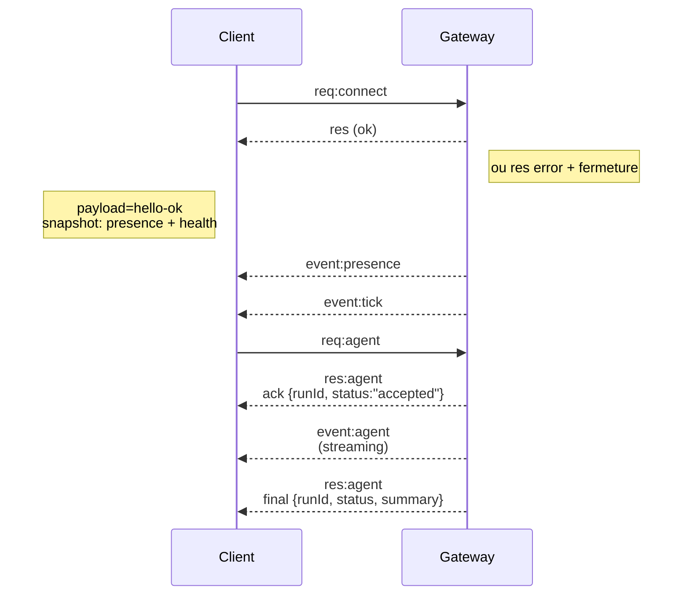

# Architecture du Gateway

Dernière mise à jour : 2026-01-22

## Vue d'ensemble

- Un seul **Gateway** persistant possède toutes les surfaces de messagerie (WhatsApp via Baileys, Telegram via grammY, Slack, Discord, Signal, iMessage, WebChat).
- Les clients du plan de contrôle (application macOS, CLI, interface web, automatisations) se connectent au Gateway via **WebSocket** sur l'hôte de liaison configure (par défaut `127.0.0.1:18789`).
- Les **nœuds** (macOS/iOS/Android/headless) se connectent également via **WebSocket**, mais déclarent `rôle: node` avec des capacités/commandes explicites.
- Un seul Gateway par hôte ; c'est le seul endroit qui ouvre une session WhatsApp.
- L'**hôte canvas** est servi par le serveur HTTP du Gateway sous :
  - `/__openclaw__/canvas/` (HTML/CSS/JS modifiable par l'agent)
  - `/__openclaw__/a2ui/` (hôte A2UI)
    Il utilise le même port que le Gateway (par défaut `18789`).

## Composants et flux

### Gateway (daemon)

- Maintient les connexions aux fournisseurs.
- Expose une API WS typée (requêtes, réponses, événements push serveur).
- Valide les trames entrantes contre le JSON Schema.
- Émet des événements comme `agent`, `chat`, `presence`, `health`, `heartbeat`, `cron`.

### Clients (application mac / CLI / admin web)

- Une connexion WS par client.
- Envoient des requêtes (`health`, `status`, `send`, `agent`, `system-presence`).
- S'abonnent aux événements (`tick`, `agent`, `presence`, `shutdown`).

### Nœuds (macOS / iOS / Android / headless)

- Se connectent au **même serveur WS** avec `rôle: node`.
- Fournissent une identité de périphérique dans `connect` ; l'appairage est **basé sur le périphérique** (rôle `node`) et l'approbation réside dans le magasin d'appairage de périphériques.
- Exposent des commandes comme `canvas.*`, `camera.*`, `screen.record`, `location.get`.

Détails du protocole :

- [Protocole Gateway](/gateway/protocol)

### WebChat

- Interface statique qui utilise l'API WS du Gateway pour l'historique de chat et les envois.
- Dans les configurations distantes, se connecte via le même tunnel SSH/Tailscale que les autres clients.

## Cycle de vie d'une connexion (client unique)



## Protocole de communication (résumé)

- Transport : WebSocket, trames texte avec charges utiles JSON.
- La première trame **doit** être `connect`.
- Après le handshake :
  - Requêtes : `{type:"req", id, method, params}` → `{type:"res", id, ok, payload|error}`
  - Événements : `{type:"event", event, payload, seq?, stateVersion?}`
- Si `OPENCLAW_GATEWAY_TOKEN` (ou `--token`) est défini, `connect.params.auth.token` doit correspondre sinon le socket est fermé.
- Les clés d'idempotence sont requises pour les méthodes à effets de bord (`send`, `agent`) pour réessayer en toute sécurité ; le serveur conserve un cache de déduplication à courte durée de vie.
- Les nœuds doivent inclure `rôle: "node"` plus les capacités/commandes/permissions dans `connect`.

## Appairage + confiance locale

- Tous les clients WS (opérateurs + nœuds) incluent une **identité de périphérique** lors du `connect`.
- Les nouveaux identifiants de périphérique nécessitent une approbation d'appairage ; le Gateway émet un **token de périphérique** pour les connexions suivantes.
- Les connexions **locales** (loopback ou adresse tailnet propre à l'hôte Gateway) peuvent être auto-approuvées pour fluidifier l'expérience sur le même hôte.
- Toutes les connexions doivent signer le nonce `connect.challenge`.
- Le payload de signature `v3` lié également `platform` + `deviceFamily` ; le Gateway epingle les métadonnées appairees lors de la reconnexion et nécessite un appairage de réparation pour les changements de métadonnées.
- Les connexions **non locales** nécessitent toujours une approbation explicite.
- L'authentification Gateway (`gateway.auth.*`) s'applique toujours à **toutes** les connexions, locales ou distantes.

Détails : [Protocole Gateway](/gateway/protocol), [Appairage](/channels/pairing), [Sécurité](/gateway/security).

## Typage du protocole et génération de code

- Les schémas TypeBox définissent le protocole.
- Le JSON Schema est généré à partir de ces schémas.
- Les modèles Swift sont générés à partir du JSON Schema.

## Accès distant

- Préféré : Tailscale ou VPN.
- Alternative : tunnel SSH

  ```bash
  ssh -N -L 18789:127.0.0.1:18789 user@host
  ```

- Le même handshake + token d'authentification s'appliquent via le tunnel.
- TLS + épinglage optionnel peuvent être activés pour WS dans les configurations distantes.

## Aperçu opérationnel

- Démarrage : `openclaw gateway` (premier plan, logs sur stdout).
- Santé : `health` via WS (également inclus dans `hello-ok`).
- Supervision : launchd/systemd pour le redémarrage automatique.

## Invariants

- Exactement un Gateway contrôle une seule session Baileys par hôte.
- Le handshake est obligatoire ; toute trame non-JSON ou non-connect en premier est une fermeture forcée.
- Les événements ne sont pas rejoués ; les clients doivent actualiser en cas de lacunes.
