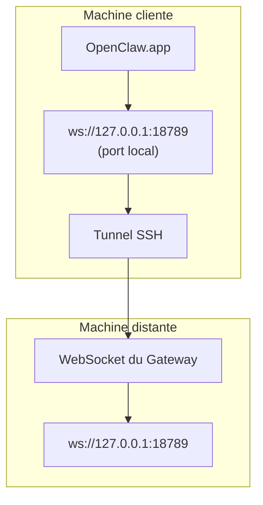

# Exécuter OpenClaw.app avec un Gateway distant

OpenClaw.app utilisé le tunneling SSH pour se connecter à un gateway distant. Ce guide vous montre comment le configurer.

## Vue d'ensemble



## Configuration rapide

### Étape 1 : Ajouter la configuration SSH

Modifiez `~/.ssh/config` et ajoutez :

```ssh
Host remote-gateway
    HostName <IP_DISTANTE>          # ex. : 172.27.187.184
    User <UTILISATEUR_DISTANT>      # ex. : jefferson
    LocalForward 18789 127.0.0.1:18789
    IdentityFile ~/.ssh/id_rsa
```

Remplacez `<IP_DISTANTE>` et `<UTILISATEUR_DISTANT>` par vos valeurs.

### Étape 2 : Copier la clé SSH

Copiez votre clé publique sur la machine distante (saisir le mot de passe une fois) :

```bash
ssh-copy-id -i ~/.ssh/id_rsa <UTILISATEUR_DISTANT>@<IP_DISTANTE>
```

### Étape 3 : Définir le jeton du Gateway

```bash
launchctl setenv OPENCLAW_GATEWAY_TOKEN "<votre-jeton>"
```

### Étape 4 : Démarrer le tunnel SSH

```bash
ssh -N remote-gateway &
```

### Étape 5 : Redémarrer OpenClaw.app

```bash
# Quittez OpenClaw.app (⌘Q), puis rouvrez :
open /path/to/OpenClaw.app
```

L'application se connectera désormais au gateway distant via le tunnel SSH.

---

## Démarrage automatique du tunnel à la connexion

Pour que le tunnel SSH démarre automatiquement à la connexion, créez un Launch Agent.

### Créer le fichier PLIST

Enregistrez ceci sous `~/Library/LaunchAgents/ai.openclaw.ssh-tunnel.plist` :

```xml
<?xml version="1.0" encoding="UTF-8"?>
<!DOCTYPE plist PUBLIC "-//Apple//DTD PLIST 1.0//EN" "http://www.apple.com/DTDs/PropertyList-1.0.dtd">
<plist version="1.0">
<dict>
    <key>Label</key>
    <string>ai.openclaw.ssh-tunnel</string>
    <key>ProgramArguments</key>
    <array>
        <string>/usr/bin/ssh</string>
        <string>-N</string>
        <string>remote-gateway</string>
    </array>
    <key>KeepAlive</key>
    <true/>
    <key>RunAtLoad</key>
    <true/>
</dict>
</plist>
```

### Charger le Launch Agent

```bash
launchctl bootstrap gui/$UID ~/Library/LaunchAgents/ai.openclaw.ssh-tunnel.plist
```

Le tunnel va maintenant :

- Démarrer automatiquement à la connexion
- Redémarrer en cas de plantage
- Continuer à fonctionner en arrière-plan

Note historique : supprimez tout ancien LaunchAgent `com.openclaw.ssh-tunnel` s'il est encore présent.

---

## Dépannage

**Vérifier si le tunnel fonctionne :**

```bash
ps aux | grep "ssh -N remote-gateway" | grep -v grep
lsof -i :18789
```

**Redémarrer le tunnel :**

```bash
launchctl kickstart -k gui/$UID/ai.openclaw.ssh-tunnel
```

**Arrêter le tunnel :**

```bash
launchctl bootout gui/$UID/ai.openclaw.ssh-tunnel
```

---

## Fonctionnement

| Composant                             | Rôle                                                          |
| ------------------------------------- | ------------------------------------------------------------- |
| `LocalForward 18789 127.0.0.1:18789` | Redirige le port local 18789 vers le port distant 18789       |
| `ssh -N`                              | SSH sans exécuter de commandes distantes (redirection de port uniquement) |
| `KeepAlive`                           | Redémarre automatiquement le tunnel en cas de plantage        |
| `RunAtLoad`                           | Démarre le tunnel au chargement de l'agent                    |

OpenClaw.app se connecte à `ws://127.0.0.1:18789` sur votre machine cliente. Le tunnel SSH redirige cette connexion vers le port 18789 de la machine distante où le Gateway fonctionne.
