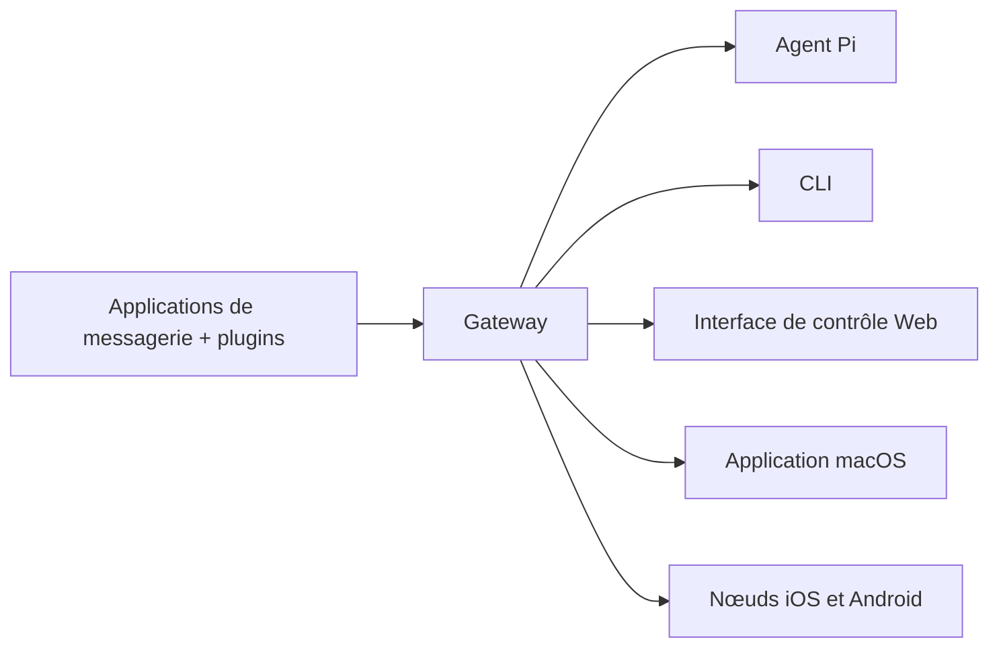

---
read_when:
  - Présentation d'OpenClaw aux nouveaux utilisateurs
summary: OpenClaw est un gateway multi-canal pour agents IA qui fonctionne sur tout système d'exploitation.
title: OpenClaw
x-i18n:
  generated_at: "2026-02-25T12:00:00Z"
  model: claude-opus-4-6
  provider: claude-code
  source_path: index.md
  workflow: manual
---

# OpenClaw 🦞

<p align="center">
    
    
</p>

> _"EXFOLIEZ ! EXFOLIEZ !"_ — Un homard de l'espace, probablement

<p align="center">
  <strong>Gateway pour agents IA sur tout système d'exploitation, compatible WhatsApp, Telegram, Discord, iMessage et plus.</strong><br />
  Envoyez un message, recevez une réponse de votre agent depuis votre poche. Les plugins ajoutent Mattermost et d'autres canaux.
</p>

<Columns>
  <Card title="Premiers pas" href="/start/getting-started" icon="rocket">
    Installez OpenClaw et lancez le Gateway en quelques minutes.
  </Card>
  <Card title="Lancer l'assistant" href="/start/wizard" icon="sparkles">
    Configuration guidée avec `openclaw onboard` et les flux d'appairage.
  </Card>
  <Card title="Ouvrir l'interface de contrôle" href="/web/control-ui" icon="layout-dashboard">
    Lancez le tableau de bord dans le navigateur pour le chat, la configuration et les sessions.
  </Card>
</Columns>

## Qu'est-ce qu'OpenClaw ?

OpenClaw est un **gateway auto-hébergé** qui connecte vos applications de messagerie préférées (WhatsApp, Telegram, Discord, iMessage et d'autres) à des agents de programmation IA comme Pi. Vous exécutez un seul processus Gateway sur votre propre machine (ou un serveur), et il devient le pont entre vos applications de messagerie et un assistant IA toujours disponible.

**À qui s'adresse-t-il ?** Aux développeurs et utilisateurs avancés qui veulent un assistant IA personnel qu'ils peuvent contacter de n'importe où, sans perdre le contrôle de leurs données ni dépendre d'un service héberge.

**Qu'est-ce qui le rend différent ?**

- **Auto-hébergé** : fonctionne sur votre matériel, selon vos règles
- **Multi-canal** : un seul Gateway dessert WhatsApp, Telegram, Discord et plus simultanément
- **Conçu pour les agents** : pensé pour les agents de programmation avec utilisation d'outils, sessions, mémoire et routage multi-agent
- **Open source** : licence MIT, développé par la communauté

**De quoi avez-vous besoin ?** Node 22+, une clé API (Anthropic recommandé), et 5 minutes.

## Comment ça fonctionne



Le Gateway est la source de référence pour les sessions, le routage et les connexions aux canaux.

## Fonctionnalités principales

<Columns>
  <Card title="Gateway multi-canal" icon="network">
    WhatsApp, Telegram, Discord et iMessage avec un seul processus Gateway.
  </Card>
  <Card title="Canaux par plugins" icon="plug">
    Ajoutez Mattermost et d'autres avec des extensions.
  </Card>
  <Card title="Routage multi-agent" icon="route">
    Sessions isolées par agent, espace de travail ou expéditeur.
  </Card>
  <Card title="Prise en charge des médias" icon="image">
    Envoi et réception d'images, audio et documents.
  </Card>
  <Card title="Interface de contrôle Web" icon="monitor">
    Tableau de bord dans le navigateur pour le chat, la configuration, les sessions et les nœuds.
  </Card>
  <Card title="Nœuds mobiles" icon="smartphone">
    Appairage de nœuds iOS et Android avec support Canvas.
  </Card>
</Columns>

## Démarrage rapide

<Steps>
  <Step title="Installer OpenClaw">
    ```bash
    npm install -g openclaw@latest
    ```
  </Step>
  <Step title="Configuration initiale et installation du service">
    ```bash
    openclaw onboard --install-daemon
    ```
  </Step>
  <Step title="Appairer WhatsApp et démarrer le Gateway">
    ```bash
    openclaw channels login
    openclaw gateway --port 18789
    ```
  </Step>
</Steps>

Besoin de l'installation complète et de la configuration de développement ? Voir [Démarrage rapide](/start/quickstart).

## Tableau de bord

Ouvrez l'interface de contrôle dans le navigateur après le démarrage du Gateway.

- Adresse locale par défaut : [http://127.0.0.1:18789/](http://127.0.0.1:18789/)
- Accès distant : [Surfaces Web](/web) et [Tailscale](/gateway/tailscale)

<p align="center">
  
</p>

## Configuration (optionnelle)

La configuration se trouve dans `~/.openclaw/openclaw.json`.

- Si vous **ne faites rien**, OpenClaw utilise le binaire Pi intégré en mode RPC avec des sessions par expéditeur.
- Si vous souhaitez restreindre l'accès, commencez par `channels.whatsapp.allowFrom` et (pour les groupes) les règles de mention.

Exemple :

```json5
{
  channels: {
    whatsapp: {
      allowFrom: ["+15555550123"],
      groups: { "*": { requireMention: true } },
    },
  },
  messages: { groupChat: { mentionPatterns: ["@openclaw"] } },
}
```

## Commencer ici

<Columns>
  <Card title="Centres de documentation" href="/start/hubs" icon="book-open">
    Toute la documentation et les guides, organisés par cas d'usage.
  </Card>
  <Card title="Configuration" href="/gateway/configuration" icon="settings">
    Paramètres principaux du Gateway, jetons et configuration des fournisseurs.
  </Card>
  <Card title="Accès distant" href="/gateway/remote" icon="globe">
    Modèles d'accès SSH et tailnet.
  </Card>
  <Card title="Canaux" href="/channels/telegram" icon="message-square">
    Configuration spécifique pour WhatsApp, Telegram, Discord et plus.
  </Card>
  <Card title="Nœuds" href="/nodes" icon="smartphone">
    Nœuds iOS et Android avec appairage et Canvas.
  </Card>
  <Card title="Aide" href="/help" icon="life-buoy">
    Corrections courantes et point d'entrée pour le dépannage.
  </Card>
</Columns>

## En savoir plus

<Columns>
  <Card title="Liste complète des fonctionnalités" href="/concepts/features" icon="list">
    Toutes les fonctionnalités de canaux, routage et médias.
  </Card>
  <Card title="Routage multi-agent" href="/concepts/multi-agent" icon="route">
    Isolation des espaces de travail et sessions par agent.
  </Card>
  <Card title="Sécurité" href="/gateway/security" icon="shield">
    Jetons, listes autorisées et contrôles de sécurité.
  </Card>
  <Card title="Dépannage" href="/gateway/troubleshooting" icon="wrench">
    Diagnostics du Gateway et erreurs courantes.
  </Card>
  <Card title="À propos et crédits" href="/reference/credits" icon="info">
    Origines du projet, contributeurs et licence.
  </Card>
</Columns>
