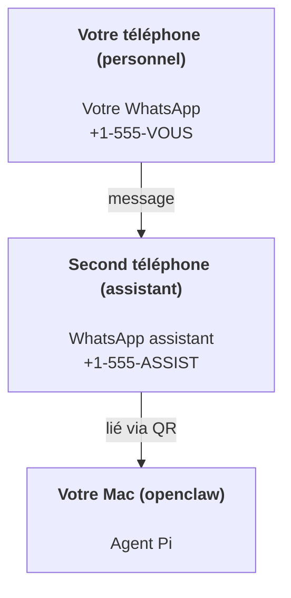

---
read_when:
  - Configuration d'une nouvelle instance d'assistant
  - Examen des implications de sécurité et de permissions
summary: Guide complet pour utiliser OpenClaw comme assistant personnel avec les précautions de sécurité
title: Configuration d'assistant personnel
x-i18n:
  generated_at: "2026-02-25T12:00:00Z"
  model: claude-opus-4-6
  provider: claude-code
  source_path: start/openclaw.md
  workflow: manual
---

# Créer un assistant personnel avec OpenClaw

OpenClaw est un gateway WhatsApp + Telegram + Discord + iMessage pour les agents **Pi**. Les plugins ajoutent Mattermost. Ce guide concerne la configuration « assistant personnel » : un numéro WhatsApp dédié qui se comporte comme votre agent toujours disponible.

## ⚠️ Sécurité d'abord

Vous placez un agent en position de :

- exécuter des commandes sur votre machine (selon la configuration de vos outils Pi)
- lire/écrire des fichiers dans votre espace de travail
- envoyer des messages via WhatsApp/Telegram/Discord/Mattermost (plugin)

Commencez prudemment :

- Définissez toujours `channels.whatsapp.allowFrom` (n'exécutez jamais l'assistant ouvert au monde entier sur votre Mac personnel).
- Utilisez un numéro WhatsApp dédié pour l'assistant.
- Les heartbeats sont maintenant par défaut toutes les 30 minutes. Désactivez-les jusqu'à ce que vous fassiez confiance à la configuration en réglant `agents.defaults.heartbeat.every: "0m"`.

## Prérequis

- OpenClaw installé et configure — consultez [Premiers pas](/start/getting-started) si ce n'est pas encore fait
- Un second numéro de téléphone (SIM/eSIM/prépayé) pour l'assistant

## La configuration à deux téléphones (recommandée)

Voici ce que vous voulez :



Si vous liez votre WhatsApp personnel à OpenClaw, chaque message reçu devient une « entrée pour l'agent ». C'est rarement ce que vous souhaitez.

## Démarrage en 5 minutes

1. Appairer WhatsApp Web (affiche un QR ; scannez avec le téléphone assistant) :

```bash
openclaw channels login
```

2. Démarrer le Gateway (laissez-le tourner) :

```bash
openclaw gateway --port 18789
```

3. Placer une configuration minimale dans `~/.openclaw/openclaw.json` :

```json5
{
  channels: { whatsapp: { allowFrom: ["+15555550123"] } },
}
```

Envoyez maintenant un message au numéro de l'assistant depuis votre téléphone en liste autorisée.

Lorsque la configuration initiale est terminée, le tableau de bord s'ouvre automatiquement avec un lien propre (non tokenisé). S'il demande une authentification, collez le jeton de `gateway.auth.token` dans les paramètres de l'interface de contrôle. Pour rouvrir plus tard : `openclaw dashboard`.

## Donner un espace de travail à l'agent (AGENTS)

OpenClaw lit les instructions opérationnelles et la « mémoire » depuis le répertoire de l'espace de travail.

Par défaut, OpenClaw utilise `~/.openclaw/workspace` comme espace de travail de l'agent, et le crée automatiquement (avec les fichiers `AGENTS.md`, `SOUL.md`, `TOOLS.md`, `IDENTITY.md`, `USER.md`, `HEARTBEAT.md`) lors de la configuration ou du premier lancement de l'agent. `BOOTSTRAP.md` n'est créé que lorsque l'espace de travail est tout neuf (il ne devrait pas réapparaître après suppression). `MEMORY.md` est optionnel (non crée automatiquement) ; lorsqu'il est présent, il est chargé pour les sessions normales. Les sessions de sous-agents n'injectent que `AGENTS.md` et `TOOLS.md`.

Conseil : traitez ce dossier comme la « mémoire » d'OpenClaw et faites-en un dépôt git (de préférence privé) pour que vos fichiers `AGENTS.md` + mémoire soient sauvegardés. Si git est installé, les nouveaux espaces de travail sont automatiquement initialisés.

```bash
openclaw setup
```

Structure complète de l'espace de travail et guide de sauvegarde : [Espace de travail de l'agent](/concepts/agent-workspace)
Flux de travail mémoire : [Mémoire](/concepts/memory)

Optionnel : choisissez un espace de travail différent avec `agents.defaults.workspace` (supporte `~`).

```json5
{
  agent: {
    workspace: "~/.openclaw/workspace",
  },
}
```

Si vous fournissez déjà vos propres fichiers d'espace de travail depuis un dépôt, vous pouvez désactiver entièrement la création des fichiers d'initialisation :

```json5
{
  agent: {
    skipBootstrap: true,
  },
}
```

## La configuration qui en fait « un assistant »

OpenClaw est configuré par défaut pour un bon comportement d'assistant, mais vous voudrez généralement ajuster :

- le persona/les instructions dans `SOUL.md`
- les paramètres de réflexion par défaut (si souhaité)
- les heartbeats (une fois que vous avez confiance)

Exemple :

```json5
{
  logging: { level: "info" },
  agent: {
    model: "anthropic/claude-opus-4-6",
    workspace: "~/.openclaw/workspace",
    thinkingDefault: "high",
    timeoutSeconds: 1800,
    // Commencer à 0 ; activer plus tard.
    heartbeat: { every: "0m" },
  },
  channels: {
    whatsapp: {
      allowFrom: ["+15555550123"],
      groups: {
        "*": { requireMention: true },
      },
    },
  },
  routing: {
    groupChat: {
      mentionPatterns: ["@openclaw", "openclaw"],
    },
  },
  session: {
    scope: "per-sender",
    resetTriggers: ["/new", "/reset"],
    reset: {
      mode: "daily",
      atHour: 4,
      idleMinutes: 10080,
    },
  },
}
```

## Sessions et mémoire

- Fichiers de session : `~/.openclaw/agents/<agentId>/sessions/{{SessionId}}.jsonl`
- Métadonnées de session (utilisation de jetons, dernier routage, etc.) : `~/.openclaw/agents/<agentId>/sessions/sessions.json` (ancien emplacement : `~/.openclaw/sessions/sessions.json`)
- `/new` ou `/reset` démarre une nouvelle session pour ce chat (configurable via `resetTriggers`). Si envoyé seul, l'agent répond avec un court bonjour pour confirmer la réinitialisation.
- `/compact [instructions]` compacte le contexte de session et rapporte le budget de contexte restant.

## Heartbeats (mode proactif)

Par défaut, OpenClaw exécute un heartbeat toutes les 30 minutes avec le prompt :
`Read HEARTBEAT.md if it exists (workspace context). Follow it strictly. Do not infer or repeat old tasks from prior chats. If nothing needs attention, reply HEARTBEAT_OK.`
Réglez `agents.defaults.heartbeat.every: "0m"` pour désactiver.

- Si `HEARTBEAT.md` existe mais est effectivement vide (uniquement des lignes vierges et des en-têtes markdown comme `# Heading`), OpenClaw ignore l'exécution du heartbeat pour économiser les appels API.
- Si le fichier est manquant, le heartbeat s'exécute quand même et le modèle décide quoi faire.
- Si l'agent répond avec `HEARTBEAT_OK` (optionnellement avec un court remplissage ; voir `agents.defaults.heartbeat.ackMaxChars`), OpenClaw supprime la livraison sortante pour ce heartbeat.
- Par défaut, la livraison de heartbeat vers les cibles de type DM `user:<id>` est autorisée. Définissez `agents.defaults.heartbeat.directPolicy: "block"` pour supprimer la livraison vers les cibles directes tout en gardant les exécutions de heartbeat activés.
- Les heartbeats exécutent des tours complets d'agent : des intervalles plus courts consomment plus de jetons.

```json5
{
  agent: {
    heartbeat: { every: "30m" },
  },
}
```

## Médias en entrée et en sortie

Les pièces jointes entrantes (images/audio/documents) peuvent être exposées à votre commande via des modèles :

- `{{MediaPath}}` (chemin du fichier temporaire local)
- `{{MediaUrl}}` (pseudo-URL)
- `{{Transcript}}` (si la transcription audio est activée)

Pièces jointes sortantes de l'agent : incluez `MEDIA:<chemin-ou-url>` sur sa propre ligne (sans espaces). Exemple :

```
Voici la capture d'écran.
MEDIA:https://example.com/screenshot.png
```

OpenClaw extrait ces éléments et les envoie en tant que médias accompagnant le texte.

## Checklist opérationnelle

```bash
openclaw status          # état local (identifiants, sessions, événements en file)
openclaw status --all    # diagnostic complet (lecture seule, copiable)
openclaw status --deep   # ajoute les sondes de santé du gateway (Telegram + Discord)
openclaw health --json   # instantané de santé du gateway (WS)
```

Les logs se trouvent sous `/tmp/openclaw/` (par défaut : `openclaw-YYYY-MM-DD.log`).

## Étapes suivantes

- WebChat : [WebChat](/web/webchat)
- Opérations Gateway : [Guide opérationnel du Gateway](/gateway)
- Tâches cron et réveils : [Tâches cron](/automation/cron-jobs)
- Application compagnon macOS : [Application macOS OpenClaw](/platforms/macos)
- Application nœud iOS : [Application iOS](/platforms/ios)
- Application nœud Android : [Application Android](/platforms/android)
- État Windows : [Windows (WSL2)](/platforms/windows)
- État Linux : [Application Linux](/platforms/linux)
- Sécurité : [Sécurité](/gateway/security)
